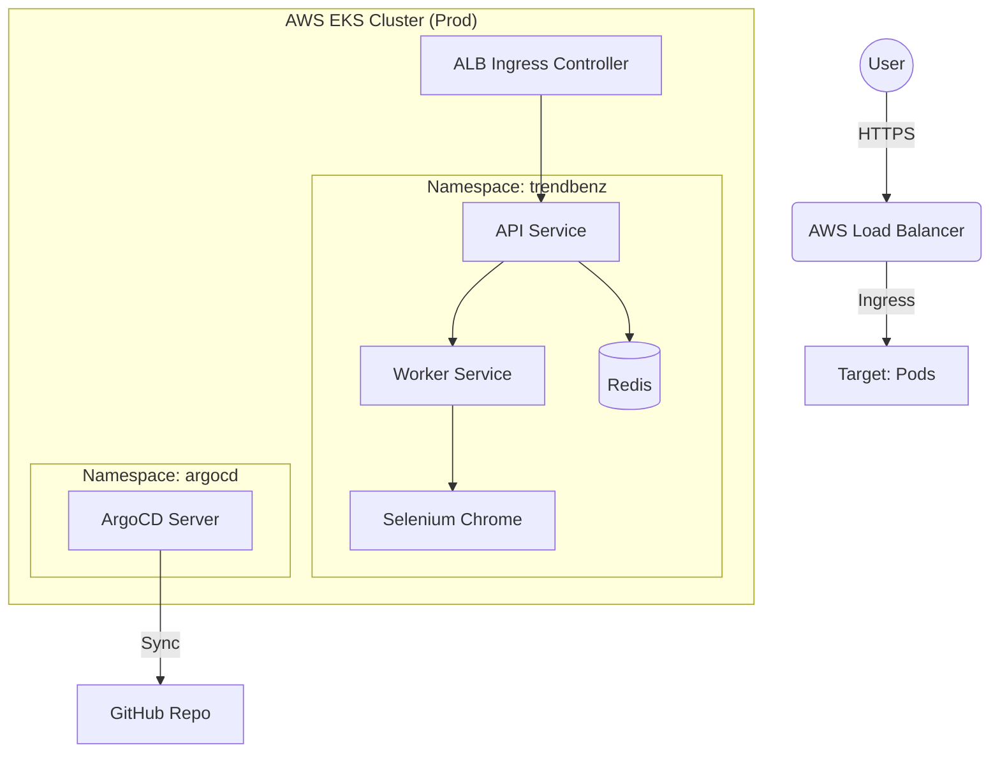

# TrendLens Infrastructure


> **Modern GitOps-based Infrastructure for TrendLens Service**
>
> 
> 
> 

TrendLens 서비스를 위한 **Infrastructure as Code (IaC)** 저장소입니다.  
AWS EKS 클러스터와 ArgoCD 도입을 위한 **GitOps 기반 폴더 구조**를 제공합니다.

---

## 🏗️ Architecture Overview



---

## 📂 Directory Structure

| Directory | Description |
|-----------|-------------|
| **`apps/`** | **GitOps Manifests (Ready for ArgoCD)**<br>- `base/`: 공통 리소스 (API, Worker, Redis 등)<br>- `dev/`: 로컬/개발 환경 Overlay (Replica: 1, Local Image)<br>- `prod/`: 운영 환경 Overlay (Replica: 2, ECR Image, High Availability) |
| **`addons/`** | **EKS Add-ons**<br>- `alb-controller/`: Ingress Controller 설정<br>- `ebs-csi/`: Persistent Volume을 위한 CSI Driver |
| **`cluster/`** | **Cluster Provisioning & Scaling Config**<br>- `cluster.yaml`: eksctl 클러스터 정의 (NodeGroup, IAM)<br>- `nodegroup.yaml`: 워커 노드 스펙 및 AutoScaling Group (ASG) 범위 설정 |
| **`k6/`** | **Performance Testing**<br>- 부하 테스트 스크립트 (HPA, Autoscaling 검증용) |
| **`scripts/`** | **Automation Utilities**<br>- 클러스터 생성 및 Secret 관리 스크립트 |

---

## 🚀 Getting Started

### 1. Prerequisites
- AWS CLI & `eksctl` configured
- `kubectl` & `kustomize` installed
- `argocd` CLI (optional)

### 2. Deploy Cluster
```bash
# EKS 클러스터 생성
eksctl create cluster -f cluster/cluster.yaml
```

### 3. Install Addons
```bash
# ALB Controller 및 EBS CSI 드라이버 설치
./scripts/install-addons.sh
```

### 4. Deploy Applications via ArgoCD
```bash
# ArgoCD 애플리케이션 등록
kubectl apply -f argocd/app-of-apps.yaml
```

---

## ⚡ Environment Strategy

- **Development (`apps/dev`)**:
  - 빠른 반복 개발을 위한 경량화 구성
  - 로컬 이미지 (`api:local`) 사용
  - 불필요한 리소스 제한 최소화

- **Production (`apps/prod`)**:
  - 고가용성 (HA) 구성 (Replicas: 2+)
  - 안정적인 ECR 이미지 태그 사용 (`Need CI/CD`)
  - 리소스 제한 (Limits/Requests) 및 Health Probe 적용

